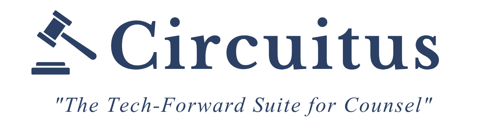

<p align="center">
  
</p>

<p align="center">
  <strong>Legal research that looks like legal research.</strong>
</p>

<p align="center">
  <a href="https://circuitus.pages.dev"></a>
  <a href="LICENSE"></a>
  <a href="https://github.com/foolish-bandit/Circuitus/stargazers"></a>
</p>

<p align="center">
  A web-based document reader, annotation system, and curated practice library<br/>
  with legal-grade typography and a professional research interface.<br/><br/>
  Everything runs in the browser. Nothing is uploaded. Nothing phones home.<br/><br/>
  <kbd>Ctrl</kbd>+<kbd>Shift</kbd>+<kbd>K</kbd>
</p>

---

## Features

<table>
<tr>
<td width="50%">

**Document Reader**

- Import PDFs, EPUBs, and plain text
- Legal typography — justified serif, section numbering (&#167;), exhibit captioning
- Three font-size presets, toggleable paragraph numbering
- Scroll position saved per document
- Tabbed multi-document workspace

</td>
<td width="50%">

**Annotations**

- Highlight text in three colors (yellow, blue, green)
- Bookmark any passage
- All annotations saved locally via IndexedDB
- Organized by document and chapter
- No account required, no cloud sync

</td>
</tr>
<tr>
<td width="50%">

**Built-In Library**

12 practice guides covering:
- California contract law & SOW structuring
- AI governance frameworks
- CCPA/CPRA compliance (2026 update)
- NDA drafting with technology carve-outs
- Vendor agreements & DPAs
- Incident response planning
- IP provisions in tech agreements

Real statutory citations throughout.

</td>
<td width="50%">

**Research Interface**

- Left sidebar: navigable table of contents (auto-generated from headings)
- Right sidebar: related authorities with type badges (guide, article, case)
- Keyboard navigation between chapters
- Full-text search across the library
- Responsive layout — sidebars collapse gracefully

</td>
</tr>
</table>

---

## Quick Reference Mode

<kbd>Ctrl</kbd>+<kbd>Shift</kbd>+<kbd>K</kbd> instantly switches the entire UI to display a practice guide on SOW structuring. Your previous state is saved and restored when you press the shortcut again.

The status bar indicates when quick-reference mode is active.

---

## Try It

**Live at [circuitus.pages.dev](https://circuitus.pages.dev)**

Or run locally:

```bash
git clone https://github.com/foolish-bandit/Circuitus.git
cd Circuitus
npm install
npm run dev
```

No API keys. No backend. No accounts. Opens in your browser.

---

## Architecture

```
All data lives client-side.
No server. No uploads. No tracking. No analytics.
```

| Layer | Tech |
|-------|------|
| Frontend | React 19, TypeScript, Tailwind CSS |
| Build | Vite |
| Storage | IndexedDB (documents, highlights, bookmarks) |
| PDF parsing | pdf.js (spatial text extraction, heading detection) |
| EPUB parsing | JSZip (OPF spine extraction) |
| Icons | Lucide React |

**Design:** Navy and gold color scheme. Libre Baskerville for document text, sans-serif for interface chrome. Styled to feel like a professional legal research platform.

---

## Contributing

```bash
npm install
npm run dev       # dev server
npm run build     # production build
```

PRs welcome — especially new practice guides, document format support, and annotation features.

---

## License

GPL-3.0

<p align="center">
  <sub>Built by <a href="https://github.com/foolish-bandit">Zack Brenner</a></sub>
</p>
